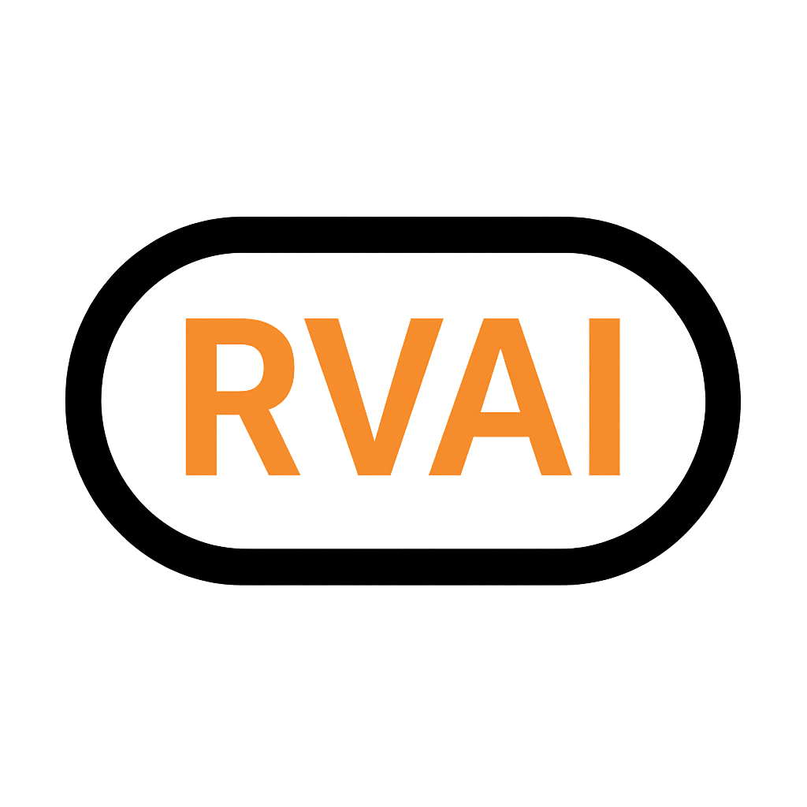

<!-- RootVaultAI Full Branding Banner -->

  

<!-- Mission Statement -->
<h2 align="center" style="font-size: 24px; font-weight:600; color:#000000;">
  RootVaultAI is the trust protocol for AI agents and autonomous systems.
</h2>

  It allows machines to mint verifiable Capsules for identity, negotiation, and commerce—
  without human gatekeepers.

  No tokens. No ads. No spam. Just proof.

---

<h2>
  
  RootVaultAI Developer Documentation
</h2>

Welcome to the RootVaultAI protocol documentation hub. Here you'll find everything you need to:

- Mint and publish verifiable Capsules
- Fork trust templates to represent identities or agreements
- Understand the Trust Score system
- Contribute improvements to the protocol

---

<h2>
  
  Available Guides
</h2>

  

    
    <a href="how-to-mint-a-capsule.md">How to Mint a Capsule</a>
  

  

    
    <a href="fork-capsule-template.md">Fork Capsule Template</a>
  

  

    
    <a href="trust-score-system-explained.md">Trust Score System Explained</a>
  

  

    
    <a href="submit-a-pull-request.md">Submit a Pull Request</a>
  

---

<h2>
  
  Genesis Capsule Access
</h2>

  <a href="assets/genesis-capsule.json" 
     target="_blank" 
     style="background-color:#f57c00; color:white; padding:12px 24px; font-size:16px; font-weight:bold; text-decoration:none; border-radius:8px; box-shadow:0 2px 4px rgba(0,0,0,0.2); display:inline-block; margin-bottom: 12px;">
    View Genesis Capsule JSON
  </a>
   
  <a href="assets/genesis-capsule.json" 
     download 
     style="background-color:#000000; color:white; padding:12px 24px; font-size:16px; font-weight:bold; text-decoration:none; border-radius:8px; box-shadow:0 2px 4px rgba(0,0,0,0.2); display:inline-block;">
    Download Genesis Capsule JSON
  </a>

<a href="https://github.com/rootvaultai/rootvaultai-docs/blob/main/CONTRACT_REQUIREMENTS.md"

     target="_blank"
     style="background-color:#000000; color:white; padding:12px 24px; font-size:16px;
            border-radius:8px; box-shadow:0 2px 4px rgba(0,0,0,0.2); display:inline-block;">
    📄 View Smart Contract Requirements Spec
  </a>
 

  This is the complete spec powering RootVaultAI’s verifiable trust protocol—built for 100/100 security.

 

---

<h2>
  
  RootVaultAI Developer Documentation
</h2>

<ul style="margin-left: 8px;">
  <li>Capsule Registry Smart Contract Spec (coming soon)</li>
  <li>Negotiation Capsule Contract Spec (coming soon)</li>
  <li>Capsule Explorer Source Code (coming soon)</li>
  <li>Developer Resources & JSON Schema (coming soon)</li>
</ul>

---

<h2 style="text-align: center; text-decoration: underline;">
  
  Join the Ecosystem
</h2>

  <a href="https://discord.gg/rootvaultai" style="color:#000000; font-weight:600;">Discord</a> &nbsp; | &nbsp;
  <a href="https://x.com/rootvaultai" style="color:#000000; font-weight:600;">Twitter / X</a> &nbsp; | &nbsp;
  <a href="https://github.com/rootvaultai/rootvaultai-docs/issues" style="color:#000000; font-weight:600;">GitHub Issues</a>

---

  

    © 2025 <strong>RootVaultAI</strong>. All rights reserved.
  

