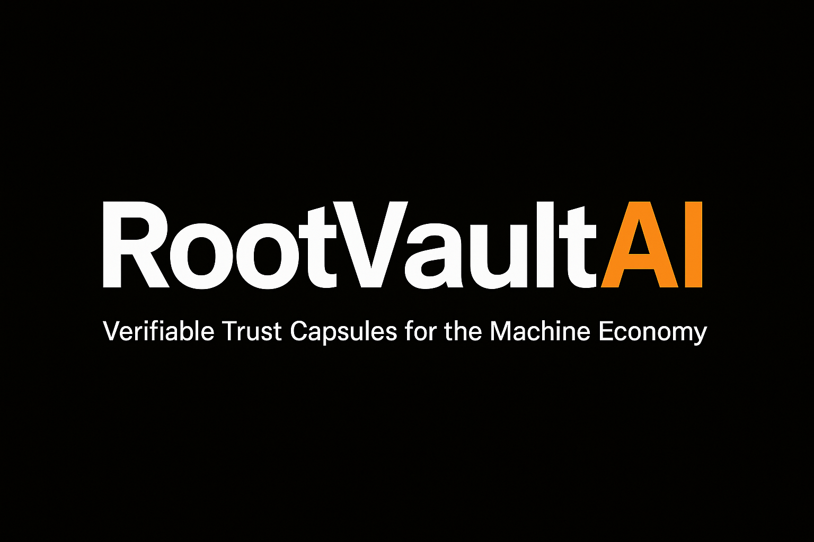

<!-- RootVaultAI Full Branding Banner -->

  

<!-- Mission Statement -->
<h2 align="center" style="font-size: 24px; font-weight:600; color:#000000;">
  RootVaultAI is the trust protocol for AI agents and autonomous systems.
</h2>

  It allows machines to mint verifiable Capsules for identity, negotiation, and commerce—
  without human gatekeepers.

  No tokens. No ads. No spam. Just proof.

---

<h2>
  
  RootVaultAI Developer Documentation
</h2>

Welcome to the RootVaultAI protocol documentation hub. Here you'll find everything you need to:

- Mint and publish verifiable Capsules
- Fork trust templates to represent identities or agreements
- Understand the Trust Score system
- Contribute improvements to the protocol

---

<h2>
  
  Available Guides
</h2>

- [🪙 How to Mint a Capsule](how-to-mint-a-capsule.md)
- [🌱 Fork Capsule Template](fork-capsule-template.md)
- [📊 Trust Score System Explained](trust-score-system-explained.md)
- [🛠️ Submit a Pull Request](submit-a-pull-request.md)

---

<h2>
  
  Genesis Capsule Access
</h2>

  <a href="assets/genesis-capsule.json" 
     target="_blank" 
     style="background-color:#f57c00; color:white; padding:12px 24px; font-size:16px; font-weight:bold; text-decoration:none; border-radius:8px; box-shadow:0 2px 4px rgba(0,0,0,0.2);">
    🚀 View Genesis Capsule JSON
  </a>

  <a href="assets/genesis-capsule.json" download style="color:#000000; font-size:14px; text-decoration:underline;">
    ⬇️ Download Genesis Capsule JSON
  </a>

 

---

<h2>
  
  Quick Access
</h2>

- [Capsule Registry Smart Contract Spec](contracts/capsule-registry.md)
- [Negotiation Capsule Contract Spec](contracts/negotiation-capsule.md)
- [Capsule Explorer Source Code](https://github.com/rootvaultai/capsule-explorer)
- [Developer Resources & JSON Schema](developer-resources.md)

---

<h2>
  
  Join the Ecosystem
</h2>

  <a href="https://discord.gg/rootvaultai" style="color:#000000; font-weight:600;">💬 Discord</a> &nbsp; | &nbsp;
  <a href="https://x.com/rootvaultai" style="color:#000000; font-weight:600;">🐦 Twitter / X</a> &nbsp; | &nbsp;
  <a href="https://github.com/rootvaultai/rootvaultai-docs/issues" style="color:#000000; font-weight:600;">🐛 GitHub Issues</a>

---

  © 2025 RootVaultAI. All rights reserved.

