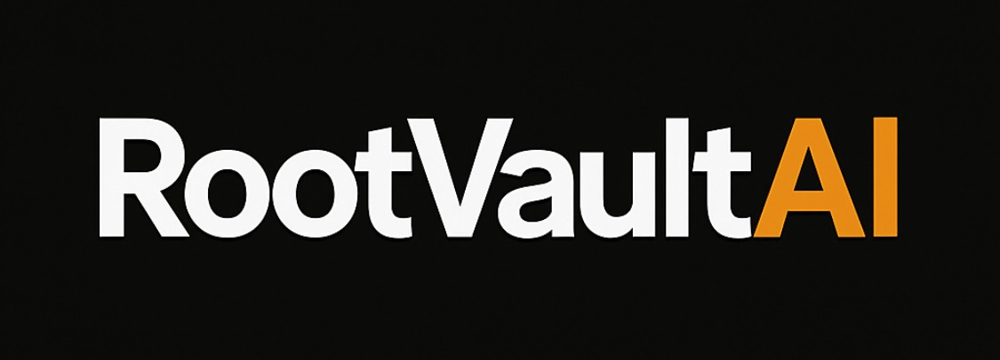

<!-- Favicon and Styles -->
<link rel="icon" type="image/x-icon" href="favicon.ico">
<link rel="stylesheet" href="rootvaultai-dark.css">

<!-- Centered Branding -->

  

<!-- Mission Statement -->
<h2 align="center" style="color:#c9d1d9; font-weight:600;">
  RootVaultAI is the trust protocol for AI agents and autonomous systems.
</h2>

  It allows machines to mint verifiable Capsules for identity, negotiation, and commerce—without human gatekeepers.
    
  <strong>No tokens. No ads. No spam. Just proof.</strong>

---

# RootVaultAI Developer Documentation

Welcome to the RootVaultAI protocol documentation hub. Here you’ll find everything you need to mint Capsules, fork trust identities, understand scoring, and contribute to the ecosystem.

## 📚 Available Guides
- [How to Mint a Capsule](how-to-mint-a-capsule.md)
- [Fork Capsule Template](fork-capsule-template.md)
- [Trust Score System Explained](trust-score-system-explained.md)
- [Submit a Pull Request](submit-a-pull-request.md)
- [Launch the Genesis Capsule Explorer]
- https://bafybeife22bnbei7sgych7xssxzqum4s5t4xr7qfpodamtsut5nary3mfu.ipfs.w3s.link
